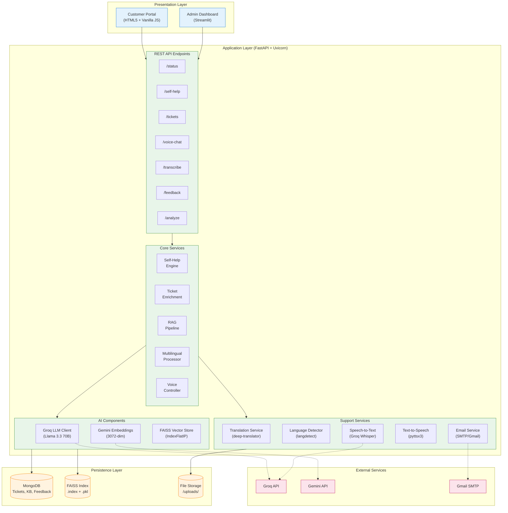
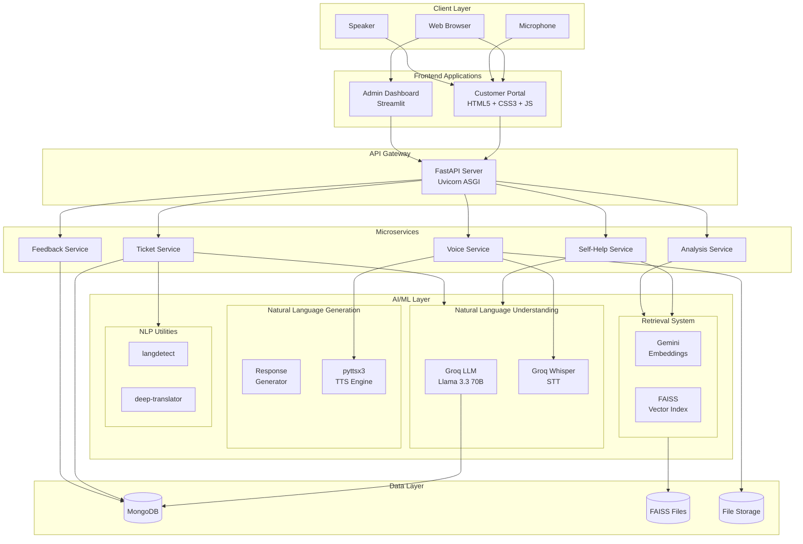
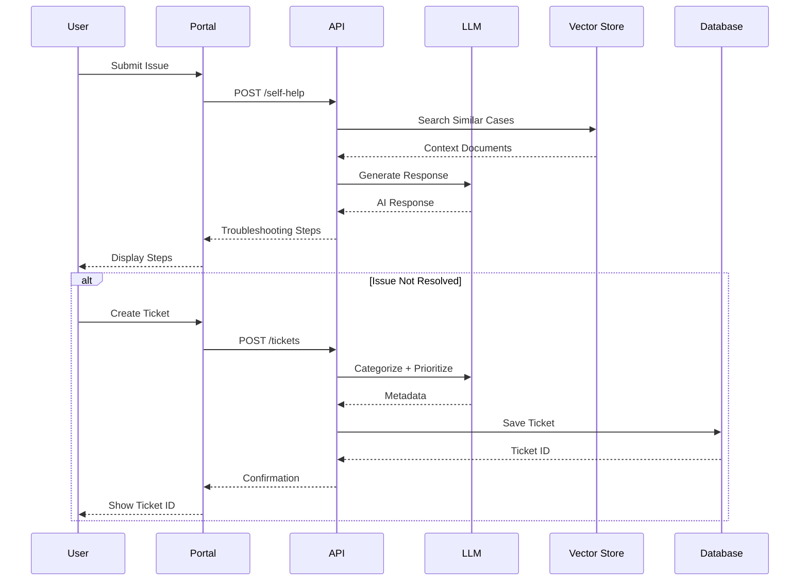

# System Architecture Diagrams

## Fig. 3.1 - Three-Tier System Architecture

### Mermaid Code (Render at https://mermaid.live/)

---

## Alternative Architecture Diagram (Detailed)

---

## Component Interaction Flow

