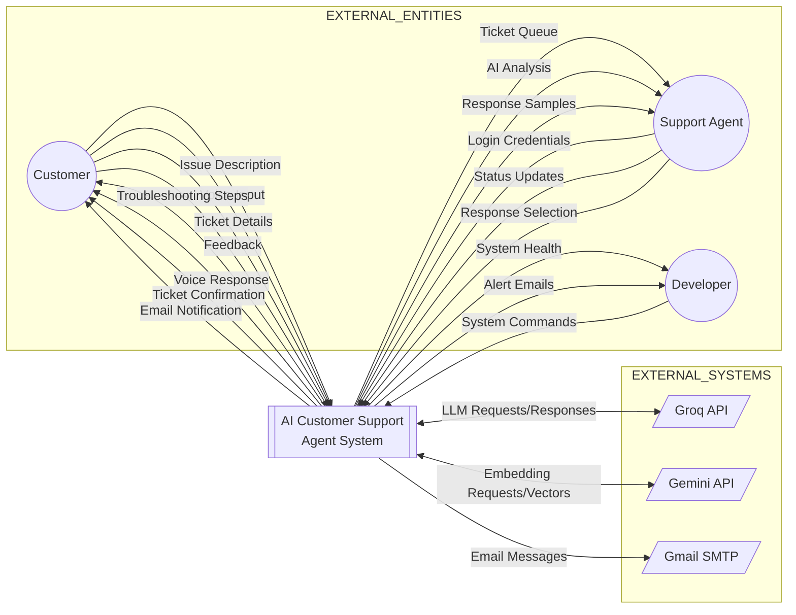
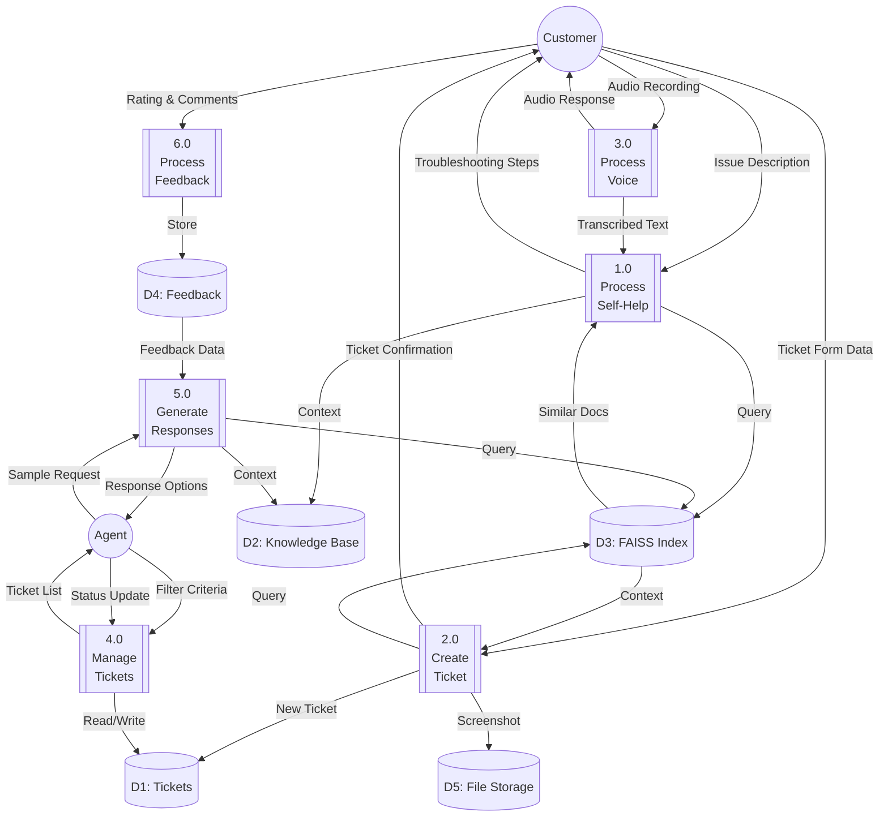
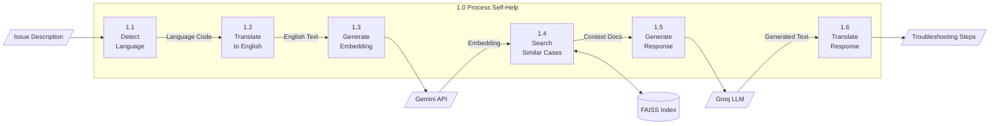
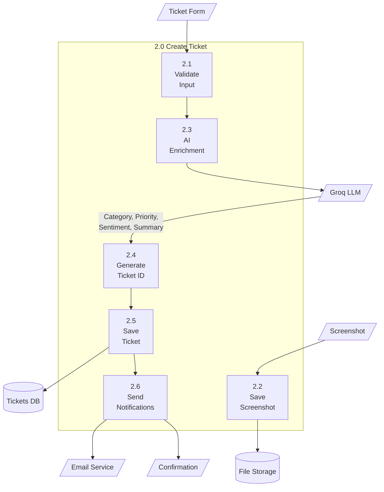
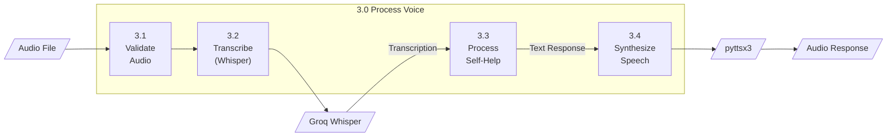

# Data Flow Diagrams (DFD)

## Fig. 3.6 - Level 0 DFD (Context Diagram)

### Mermaid Code

---

## Fig. 3.7 - Level 1 DFD (Detailed Data Flow)

---

## Level 1 DFD - Process Decomposition

### Process 1.0: Self-Help Resolution

### Process 2.0: Create Ticket

### Process 3.0: Voice Processing

---

## Data Dictionary

| Data Flow | Description | Composition |
|-----------|-------------|-------------|
| Issue Description | Customer's problem statement | Text (1-2000 chars), Language (auto-detected) |
| Ticket Form | Complete ticket submission | Email, Name, Issue, Screenshot (optional) |
| Audio Recording | Voice input from customer | WAV/MP3/WebM file, max 10MB |
| Troubleshooting Steps | AI-generated resolution steps | 2-3 numbered steps, translated if needed |
| Ticket Confirmation | Created ticket details | Ticket ID, Category, Priority, SLA, Status |
| Response Samples | Multiple AI response options | 3 responses at temps 0.3, 0.7, 1.0 |
| Context Docs | Retrieved similar cases | Top-k documents from FAISS search |
| Embedding | Vector representation | 3072-dimensional float array |
